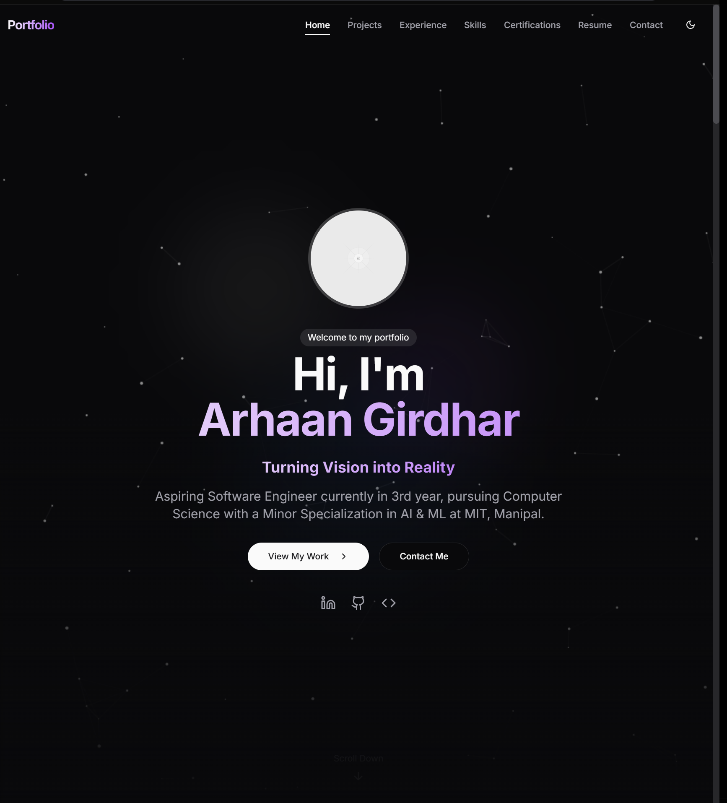

# Portfolio Website

A modern, responsive portfolio website showcasing my work and skills. Built with cutting-edge technologies and best practices in web development.



##  Features

- Responsive design that works on all devices
- Dark/Light mode support
- Smooth animations and transitions
- Contact form with email integration
- Project showcase with detailed descriptions
- Blog section for sharing insights
- Performance optimized

##  Tech Stack

- **Framework:** Next.js 15
- **Language:** TypeScript
- **Styling:** Tailwind CSS
- **UI Components:** Radix UI
- **Animations:** Framer Motion
- **Email:** Nodemailer
- **Deployment:** Vercel

##  Getting Started

1. Clone the repository
   ```bash
   git clone https://github.com/17arhaan/portfolio_v2.git
   ```

2. Install dependencies:
   ```bash
   npm install
   ```

3. Set up environment variables:
   ```bash
   cp .env.example .env.local
   ```
   Fill in your environment variables in `.env.local`

4. Run the development server:
   ```bash
   npm run dev
   ```

5. Open arhaanportfolio.in in your browser

##  Available Scripts

- `npm run dev` - Start development server
- `npm run build` - Build for production
- `npm run start` - Start production server
- `npm run lint` - Run ESLint
- `npm run format` - Format code with Prettier

##  Project Structure

```
portfolio/
├── app/              # Next.js app directory
├── components/       # Reusable UI components
├── hooks/           # Custom React hooks
├── lib/             # Utility functions
├── public/          # Static assets
└── styles/          # Global styles
```

##  Environment Variables

Create a `.env.local` file with the following variables:

```env
NEXT_PUBLIC_SITE_URL=your-site-url
SMTP_HOST=your-smtp-host
SMTP_PORT=your-smtp-port
SMTP_USER=your-smtp-user
SMTP_PASSWORD=your-smtp-password
```

##  Contributing

While this is a personal portfolio, suggestions and feedback are welcome! Feel free to open an issue or submit a pull request.

##  Contact

For any questions or inquiries, please reach out through the contact form on the website or directly via email.

17arhaa.connect@gmail.com